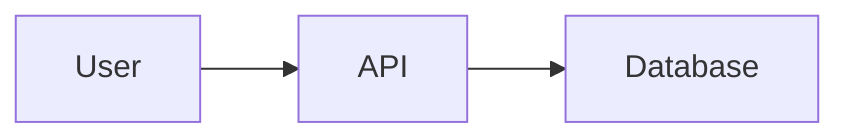

# Render Mermaid

Create Mermaid source, render it through the locally installed `mmdc` executable, and show the generated PNG to the user.

## Quick start

1. Save the Mermaid definition in a temporary `.mmd` file.
2. Run `scripts/render-mermaid.sh INPUT.mmd OUTPUT.png`.
3. Inspect `OUTPUT.png` with the local image viewer.
4. Attach or emit that image in the response, not just its file path.

For example:



## Workflow

1. Turn the user's description into valid Mermaid syntax. Preserve supplied Mermaid source unless a correction is needed to render it.
2. Use a unique temporary directory for ad-hoc diagrams. Only save source or image files in the project when the user asks to keep them.
3. Render a PNG through the helper:

   ```sh
   /path/to/mermaid-render/scripts/render-mermaid.sh diagram.mmd diagram.png
   ```

   Pass Mermaid CLI flags after the output path when useful, for example `--backgroundColor transparent`.
4. Open the PNG with the environment's image-viewing tool. If it renders incorrectly, revise the `.mmd` source and repeat.
5. Display the inspected image directly in the answer. Always also provide a clickable link to the output image file, so the user can open it if inline rendering does not work.

## CLI requirement

The helper accepts only either:

- `mmdc` available on `PATH`, or
- `node_modules/.bin/mmdc` in the current project.

It deliberately does not use `npx`, so rendering never causes a package download. If neither executable is present, explain the prerequisite and offer this installation command instead of rendering:

```sh
npm install --save-dev @mermaid-js/mermaid-cli
```

## Output guidance

- Prefer PNG because it can be displayed inline reliably.
- Use SVG only when the user explicitly needs a scalable asset; still produce a PNG preview if visual inspection is needed.
- Keep labels concise and use quoted labels when they contain punctuation that Mermaid may parse specially.
- Report Mermaid syntax or browser-rendering failures plainly, including the CLI output, and do not fabricate an image.
